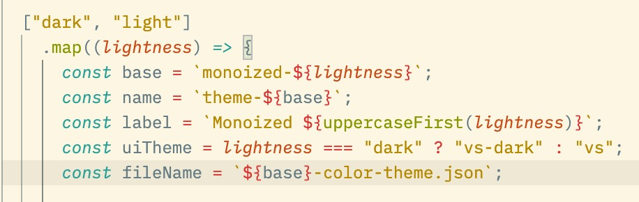
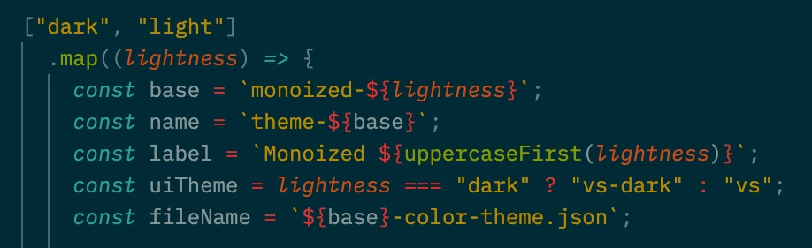

# Monoized

A theme based on [Solarized](https://ethanschoonover.com/solarized/#the-values), but with [Monokai](https://monokai.nl)'s token colors.

Currently for macOS and VS Code only.

## Getting Started

1. Make sure you have the following installed:
   - Node.js.
   - VS Code installed in /Applications, with the Monokai, Solarized Light and Solarized Dark default themes available.
2. Clone this repo.
3. Run `npm generate vscode` inside the repo's root.
4. Copy the folders inside **./build/vscode** to **~/.vscode/extensions** (alternatively, specify `install` as an additional argument and this step will be done for you).
5. Reload VS Code.

## TODO

- Add a theme for [Nova](https://nova.app).
