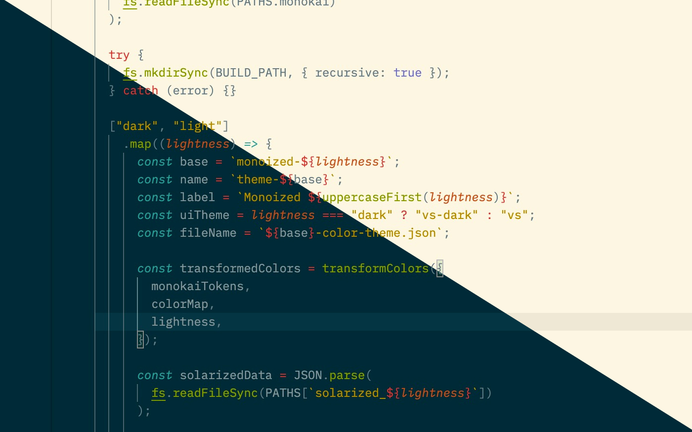

# Monoized

A theme based on [Solarized](https://ethanschoonover.com/solarized), but with [Monokai](https://monokai.nl)'s token colors and some additional tweaks.

## Notes

UI colors are copied from Solarized and preserved.

Syntax highlighting colors (`tokenColors`) are taken from Monokai and each Monokai-specific color is replaced with its Solarized counterpart.

## Supported Editors

- Visual Studio Code

## Getting Started

1. Clone this repo.
2. Inside the repo, run `npm i`.
3. Run one of the `build:foo` scripts, where `foo` is one of the supported editors.
4. Copy the folders inside **./build/foo** (where **foo** is the editor's name) to the respective editor’s extensions folder (for example, for VS Code on macOS, it’s **~/.vscode/extensions**).
5. Restart/reload the editor.

## TODO

- Add a theme for [Nova](https://nova.app).
